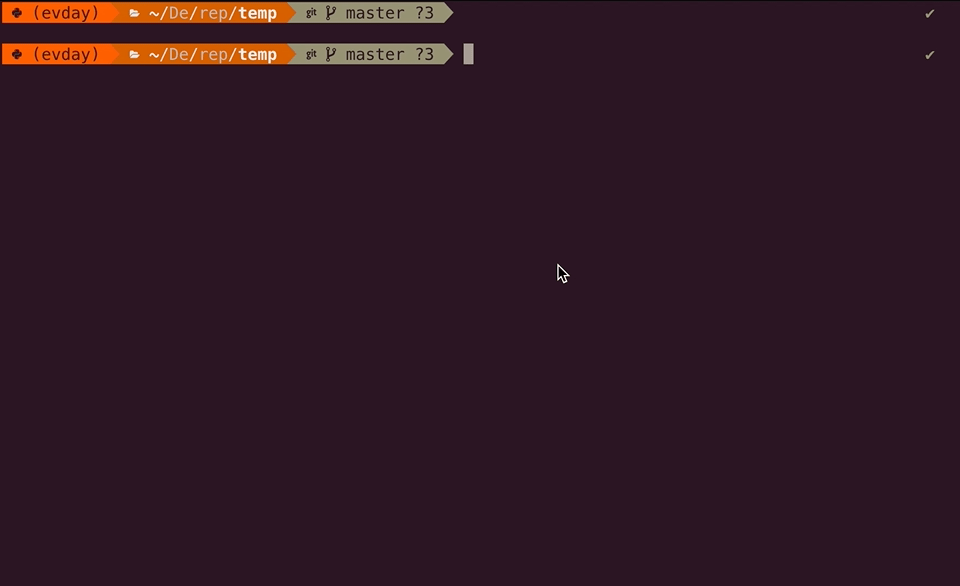

# mkcommit


`mkcommit` is an extremely simple tool made for commit message generation.

Run `mkcommit` instead of `git commit` and you will be asked questions that keep your commits tidy even when it's 3 AM.



## Why?

### Why would anybody need this? Aren't editors enough?

When working in teams it's hard to enforce proper Git commit message style from everyone. This CLI tool asks you questions to build a commit message that you can configure for yourself and your team with a very simple Python script.

### `commitlint` exists. Why `mkcommit`?

`commitlint` is a great tool. But it has considerable learning curve if you want to leverage its full potential. This tool strives to be the exact opposite: provide bare minimum with almost no overhead for your teammates. All they will need to learn is this one command: `mkcommit`.

`mkcommit` is:

- Easy to install - all you need is Python (at least version 3.6).
- Easy to configure - all you need is basic Python skills or advanced copy-pasting skills.
- Easy to use - all you need is one command to trigger the commit prompt.
- Scalable - it can be as complex as you want it, with full Git Hook integration and complex validation rules or just with a plain default Semantic Commit generation out-of-the-box.
- Pythonic - might suit you better if you're familiar with Python and don't want to venture into the world of JavaScript.

## Installation

If you have Python set up, you're good to go. Run `pip install mkcommit` and you're done.

## Configuration

1. At the root of your repository create a Python file named `my_repo.mkcommit.py`.
2. Compose the script:

    - A built-in _conventional commit_ suite can be used:

        ```python
        from mkcommit import CommitMessage, to_stdout
        from mkcommit.suites import conventional

        def commit():
            return CommitMessage(*conventional.default())

        if __name__ == "__main__":
            to_stdout(commit())
        ```

        If you're not familiar with Conventional Commits, here's a [quick guide](https://www.conventionalcommits.org/en/v1.0.0/).

    - If you need to define your own keywords and commit message template, read [Configuration](https://github.com/kjczarne/mkcommit/wiki/Configuration) in our Wiki.

        - If you want to learn how to use the hook mode, read [Hooks](https://github.com/kjczarne/mkcommit/wiki/Hooks) in our Wiki.

    - When you have implemented the file in one repo and want to use the **exact same** file in another repo, you should use `include` e.g.

        ```python
        from mkcommit import to_stdout, include

        commit, on_commit = include("https://raw.githubusercontent.com/kjczarne/mkcommit/master/test/res/example.semantic.mkcommit.py")

        if __name__ == "__main__":
            to_stdout(commit())
        ```

3. Run `mkcommit`. Select the discovered configuration file for the list and follow the interactive prompt.

## Usage

- Run `mkcommit` to generate a Git commit message and commit changes (calls `git commit -m` underneath).
- Run `mkcommit -s` to generate a Git commit message and print it to standard output.
- Run `mkcommit -c` to generate a Git commmit message and copy it to your clipboard.
- Use `mkcommit -x "some commit message"` to validate an existing commit message from the command line or as a Git Hook command (requires `on_commit(msg)` function to be implemented in the configuration file).

If you wish to point `mkcommit` to a specific configuration file, use `mkcommit -f /path/to/.mkcommit.py`. You can combine the `-f` flag with all the other available flags.

Of course you may use `mkcommit` with [VSCode tasks](https://github.com/kjczarne/mkcommit/wiki/VSCode).

### Input validation

The most basic validation strategy we use is [validation at the time of message generation](https://github.com/kjczarne/mkcommit/wiki/Validators).

For validation of commit messages that aren't originally generated with `mkcommit` you can use [Hooks](https://github.com/kjczarne/mkcommit/wiki/Hooks).

### Built-in suites

A list of suites that are supported out-of-the-box can be found in our [Wiki](https://github.com/kjczarne/mkcommit/wiki/Suites).
